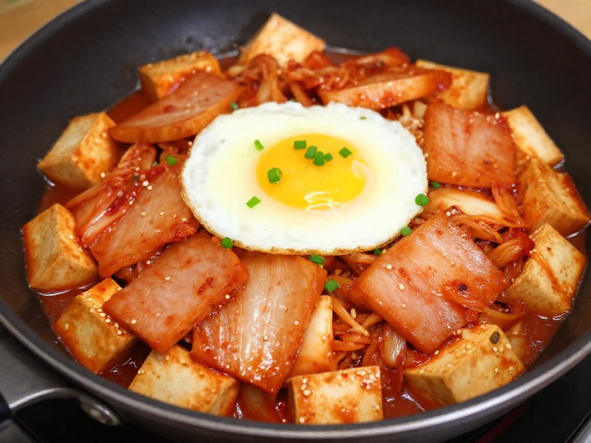

# 🍳 김치스팸두부볶음

> 조리 시간: 12분 | 난이도: 자취생 | 1인분

## 재료 (냉장고에서 확인)

| 재료 | 수량 |
|------|------|
| 김치 | 150g (한 줌) |
| 두부 | 1/2모 |
| 스팸 | 100g |
| 계란 | 1개 |
| 대파 | 1/4대 |

## 조리 순서

1. 스팸을 1cm 두께로 썰고, 두부도 같은 크기로 깍둑 썬다.
2. 달군 팬에 기름 없이 스팸을 앞뒤로 1분씩 굽다가 옆으로 밀어둔다.
3. 같은 팬에 두부를 넣고 중불에서 앞뒤로 노릇하게 굽는다 (약 3분).
4. 김치를 넣고 스팸·두부와 함께 2분간 볶는다. 국물이 생기면 살짝 졸인다.
5. 재료를 한쪽으로 밀고 빈 공간에 계란 프라이를 올린다 (반숙 기준 2분).
6. 대파를 송송 썰어 위에 올리고 불을 끈다.

## 팁

- 두부는 키친타올로 물기를 닦아야 기름이 튀지 않아요.
- 김치가 오래됐을수록 볶음 맛이 진해집니다.
- 스팸 대신 햄이나 베이컨으로도 대체 가능해요.
- 밥과 함께 먹으면 한 끼 완성!

---
*생성일: 2026-04-22 12:00*
