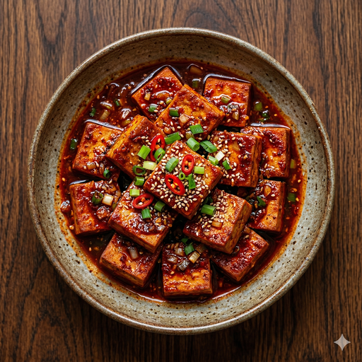

# 매콤단짠 두부조림

> *"불 위에서 완성되는 단 15분 — 소박한 두부가 품격 있는 한 접시로 거듭난다."*

콩 한 알에서 출발한 두부는 동아시아 2천 년 식문화의 정수이자, 가장 겸손한 단백질이다. 노릇하게 구워진 표면 위로 매콤달콤한 양념이 스며드는 순간, 담백함은 깊은 풍미로 변모한다. 한 모의 두부가 품격 있는 한 접시로 완성되기까지, 필요한 것은 오직 적절한 불 조절과 15분의 정성뿐이다.

---

**조리 시간** 15분 · **서빙** 1인분 · **난이도** Easy

---

## Ingredients

| | |
|:------|:------|
| 두부 (부침용) — 1/2모 (약 150g) | 대파 — 1/4대 |
| 식용유 — 2큰술 | 간장 — 2큰술 |
| 고추장 — 1/2큰술 | 알룰로스 또는 설탕 — 1큰술 |
| 다진 마늘 — 1작은술 | 고춧가루 — 1작은술 |
| 물 — 4큰술 | |

---

## Method

| Classic | Light |
|:------|:------|
| **01** 두부를 1.5cm 두께로 균일하게 썰고, 키친타월로 수분을 충분히 제거한다. | **01** 동일하게 진행한다. 수분 제거는 바삭한 표면의 전제 조건이다. |
| **02** 양념장을 구성한다: 간장 2큰술, 고추장 1큰술, 설탕 1큰술, 다진 마늘, 참기름, 고춧가루, 물을 고루 혼합한다. | **02** 양념장을 구성한다: 간장 2큰술, 고추장 1/2큰술, 알룰로스 1큰술, 다진 마늘, 고춧가루, 물을 혼합한다. 참기름은 생략한다. |
| **03** 팬에 식용유 2큰술을 두르고 중불에서 두부를 앞뒤 각 2~3분씩 황금빛으로 굽는다. | **03** 논스틱 팬에 식용유 1작은술 또는 물 스프레이를 사용하여 동일하게 굽는다. |
| **04** 불을 약불로 낮추고 양념장을 고르게 붓는다. | **04** 동일하게 진행한다. |
| **05** 양념을 끼얹어 가며 1~2분간 조린다. | **05** 동일하게 진행한다. |
| **06** 대파를 올려 마무리한다. | **06** 대파를 올려 마무리한다. |

---

## Chef's Note

| Classic Tips | Light Tips |
|:------|:------|
| 두부 수분 제거가 바삭한 표면의 핵심이다. 키친타월로 눌러 충분히 건조할 것. | 논스틱 팬과 물 스프레이를 활용하면 기름 없이도 훌륭한 결과를 얻는다. |
| 설거지 최소화를 위해 양념장은 밥그릇 또는 머그컵에 직접 혼합할 것. | 설탕을 알룰로스로 대체하고 고추장 분량을 절반으로 줄이면 칼로리를 대폭 절감할 수 있다. |
| 단맛을 강조하고 싶다면 설탕 1/2큰술을 추가한다. | 알룰로스가 없는 경우 스테비아 또는 자일리톨로 대체 가능하다. |
| 대파 대신 쪽파나 청양고추로 마무리하면 색다른 풍미를 즐길 수 있다. | 곤약밥이나 신선한 샐러드와 페어링하면 균형 잡힌 저칼로리 한 끼가 완성된다. |
| 남은 두부는 찬물에 담가 밀폐 용기에 냉장 보관하면 2~3일간 신선도가 유지된다. | 밥 없이 두부 위에 양념만 얹으면 탄수화물 없는 단백질 중심의 한 접시가 된다. |

---

> **Sommelier's Pairing** · 냉보리차 또는 무가당 현미녹차 — 매콤한 양념의 여운을 깔끔하게 정리해준다.

---

*Recipe curated by Quick Cuisine Director — where simplicity meets elegance.*
